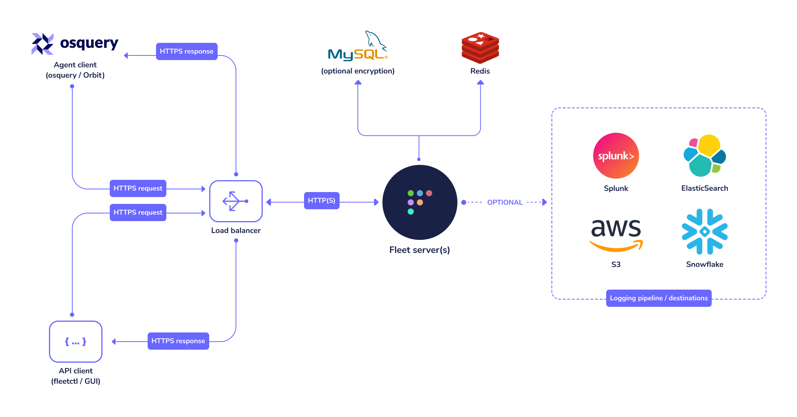

# Installer fleet sur CentOS 
0. infra de fleet :  
  


1. installer fleet :  
Le binaire se trouve dans une archive qui utilise cette convention de nommage, incluant la version actuelle : `fleet_<version>_linux.tar.gz.`  
* [Download de fleet](https://github.com/fleetdm/fleet/releases/ "Install Fleet on CentOS")  
* > tar -xf fleet_<version>_linux.tar.gz
* > sudo cp fleet_<version>_linux/fleet /usr/local/bin/ #comme ça tu peut l'utiliser partout en mode fleet .....

2. install de mysql :  
* >wget https://repo.mysql.com/mysql57-community-release-el7.rpm
* >sudo rpm -i mysql57-community-release-el7.rpm
* >sudo yum update
* >sudo yum install mysql-server
* >sudo systemctl start mysqld

3. config de mysql :  
* >mysql -u root -p (pas de mdp donc on va lui en donner un)
* >ALTER USER "root"@"localhost" IDENTIFIED BY "toor?Fl33t"; ou SET PASSWORD FOR "root"@"localhost" = PASSWORD("toor?Fl33t");
* >flush privileges;
* >exit (reco avec le mdp)
* >CREATE DATABASE fleet;

4. install de redis
* >sudo rpm -Uvh https://archives.fedoraproject.org/pub/archive/epel/6/i386/epel-release-6-8.noarch.rpm \
sudo yum install redis
* >sudo service redis start

5. config de fleet :  
```bash
fleet prepare db \
  --mysql_address=127.0.0.1:3306 \
  --mysql_database=fleet \
  --mysql_username=root \
  --mysql_password=toor?Fl33t
```

6. mise en https

* >openssl req -x509 -newkey rsa:4096 -sha256 -days 3650 -nodes \
  -keyout /tmp/server.key -out /tmp/server.cert -subj "/CN=SERVER_NAME” \
  -addext "subjectAltName=DNS:SERVER_NAME

* > pour confirmer que c'est bon t'as l'output  `Migrations completed.`

7. lancement de fleet :  
```bash
fleet serve \
  --mysql_address=127.0.0.1:3306 \
  --mysql_database=fleet \
  --mysql_username=root \
  --mysql_password=toor \
  --redis_address=127.0.0.1:6379 \
  --server_cert=/tmp/server.cert \
  --server_key=/tmp/server.key \
  --logging_json

  #ne ferme pas le temrinal /!\
```
8. Se connecter à fleet :  
* > Va sur ton navigateur pref \
puis rentre https://localhost:8080 et bim ça marche 


9. Mettre fleet en background :  


```bash
sudo systemctl enable mysqld

sudo systemctl enable redis

cd /etc/systemd/system

sudo touch fleet.service

sudo nano touch fleet.service 

#début nano
[Unit]
Description=Fleet
After=network.target

[Service]
User=root
Group=root
LimitNOFILE=8192
ExecStart=/usr/local/bin/fleet serve \
  --mysql_address=127.0.0.1:3306 \
  --mysql_database=fleet \
  --mysql_username=root \
  --mysql_password='toor?Fl33t' \
  --redis_address=127.0.0.1:6379 \
  --server_cert=/tmp/server.cert \
  --server_key=/tmp/server.key \
  --logging_json

[Install]
WantedBy=multi-user.target

#fin nano

sudo chmod 664 fleet.service

sudo chown root:root fleet.service

sudo chown root:root /tmp/osquery*

sudo systemctl daemon-reload

systemctl start fleet

#et voilà
```
10. Mettre les agent/host :  
* > WINDOWs :
    1. 


* > LINUX :
    1. 


## Source pour ce doc  
  
 • [Installation de Fleet sur CentOS (un peut daté)](https://fleetdm.com/guides/deploy-fleet-on-centos "Install Fleet on CentOS")