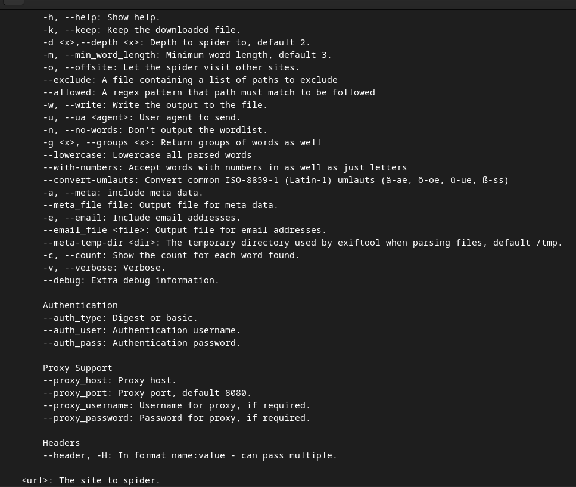
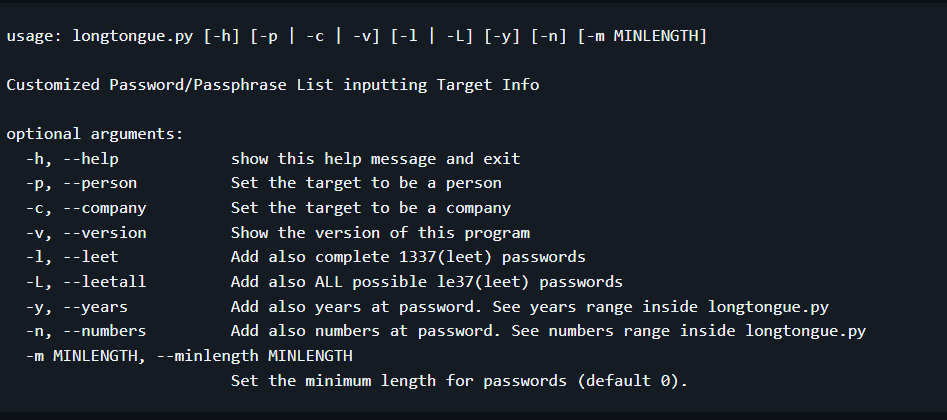

# Wordlist :) (j'ai essayé marche pas sur CentOs)

0. requirements :  
    * python3 
    * et voilà :)

1. les logiciels :  
    * **cewl** → va sur le site internet et recup info ( /!\ mais ne supprime pas une recherche d'info faite par soit ) et fais pas vraiment de wordlist
    * **longtongue** → donne les info recup via cewl + autre que tu trouve et la bim t'as ta wordlist  + tu peux mettre certaine regle  
    (pour une wordlist plus précise)

2. installation de cewl :  
    * > sudo apt install cewl -y
    * option :  
  
    * exemple : `cewl -c -a -m 5 -w data-output.txt https://example.com/`
    * et `awk -F',' '{if($2>200)print$1}' data-output.txt |tr '[:upper:]' '[:lower:]' |sort -u|tr '\n' ',' `  
    pour filter
> La commande ci-dessus prendra les mots apparaissant plus de 200 fois, convertira chaque mot en minuscules, supprimera les doublons, et ajoutera des virgules entre chaque mot.

3. installation et lancement de longtongue :  
    * `git clone https://github.com/edoardottt/longtongue.git `
    * `cd longtongue`
    * `python3 longtongue.py`
    * option :  
    
    * exemple : `python longtongue.py -c -y -l -n`

4. source & resource :  

    * source :  
    → [source](https://cybergladius.com/building-custom-company-specific-wordlists/ "source")  

    * resource :  
    → [cewl](https://github.com/digininja/CeWL "source")  
    → [longtongue](https://github.com/edoardottt/longtongue "source")  
